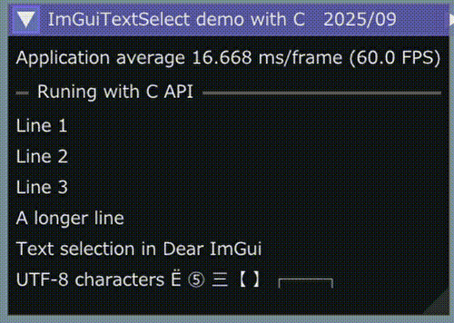

<!-- START doctoc generated TOC please keep comment here to allow auto update -->
<!-- DON'T EDIT THIS SECTION, INSTEAD RE-RUN doctoc TO UPDATE -->

- [CImGuiTextSelect](#cimguitextselect)
  - [Prerequisites](#prerequisites)
  - [Build and run](#build-and-run)
  - [Snap shot](#snap-shot)

<!-- END doctoc generated TOC please keep comment here to allow auto update -->

### CImGuiTextSelect

---

This project introduces C API to [ImGuiTextSelect](https://github.com/AidanSun05/ImGuiTextSelect) to use it with other languages and
a simple demo program with C.

Reference to :  
- [Dear ImGui](https://github.com/ocornut/imgui)
- [CImGui](https://github.com/cimgui/cimgui)

#### Prerequisites

---

- Windows OS 11 or later
   1. Install [MSys2/MinGW](https://www.msys2.org/) (Windows OS)
   1. Install packages
   
      ```sh
      pacman -S mingw-w64-ucrt-x86_64-{gcc,glfw,pkg-config} make
      ```

- Linux: Ubuntu / Debian families  
   1. Install packages

      ```sh
      $ sudo apt install gcc lib{opengl-dev,gl1-mesa-dev,glfw3-dev} make pkg-config
      ```

#### Build and run

---

1. Download this project.

   ```sh
   git clone --recursive https://github.com/dinau/CImGuiTextSelect
   ```
1. Go to demo folder

   ```sh
   cd CImGuiTextSelect/demo/cimgui
   make run 
   ```

#### Snap shot

---


